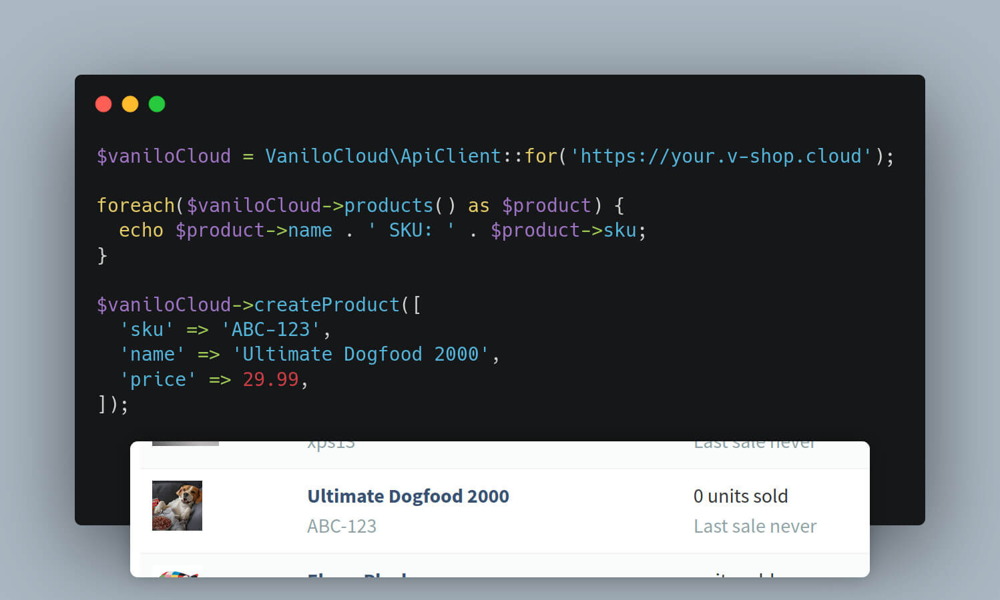

# Vanilo Cloud PHP SDK

[](https://github.com/vaniloecc/vcl-php-sdk/actions?query=workflow%3Atests)
[](https://packagist.org/packages/vanilo/cloud-sdk)
[](https://packagist.org/packages/vanilo/cloud-sdk)
[](https://styleci.io/repos/588679104)
[](LICENSE.md)

This package provides a PHP SDK for interacting with the [Vanilo Cloud REST API](https://vanilo.cloud/docs/api/).



## Installation

> The minimum requirement of this package is PHP 8.1.

To install this library in your application, use composer:

```bash
composer require vanilo/cloud-sdk
```

## Usage

### Authentication

To connect to the Vanilo Cloud API, you'll need your Shop's URL, a `client_id` and a `client_secret`.

The following code returns an API client instance:

```php
$api = VaniloCloud\ApiClient::for('https://your.v-shop.cloud')->withCredentials('client id', 'client secret');
```

> Under the hood, the SDK will fetch auth tokens from the API in order to
> minimize the number of occasions when the `client_id` and `client_secret` are
> being sent over the wire.

To connect to the generic Sandbox environment use:

```php
$api = VaniloCloud\ApiClient::sandbox();
```

> Vanilo Cloud Sandbox is available at: https://sandbox.v-shop.cloud/  
> The sandbox database is reset every 30 minutes

#### HTTP Basic Auth

If your Vanilo Cloud shop instance is protected with basic authentication, then use the
`withBasicAuth('user', 'pass')` method to pass the basic http auth credentials:

```php
ApiClient::for('https://your.shop.url')
    ->withBasicAuth('user', 'pass') // <- Add this line
    ->withCredentials('client id', 'client secret');
```

### Token Store

In order to effectively use the token authentication, and to avoid rate limiting exceptions, it's highly recommended
to use a persistent token store.

When you have the APC extension installed and enabled, then you have nothing to do, everything is handled for you
behind the scenes.

If you use this library in a Laravel Application, then the best is when you use the built-in Laravel Cache token store,
that utilizes the configured cache for temporarily storing the auth tokens:

```php
$api = VaniloCloud\ApiClient::for('https://your.v-shop.cloud')
    ->withCredentials('client id', 'client secret')
    ->useLaravelTokenStore();
```

### Retrieve Raw Responses

If you need to obtain the raw HTTP response from the API, you need to call the `rawGet`, `rawPost`, etc methods:

```php
$api = VaniloCloud\ApiClient::sandbox();
$api->rawGet('/taxonomies');
//=> Illuminate\Http\Client\Response {#2743
//     +cookies: GuzzleHttp\Cookie\CookieJar {#2725},
//     +transferStats: GuzzleHttp\TransferStats {#2765},
```

To obtain the contents of the API call, use `json()` method of the returned response:

```php
$response = $api->rawGet('/taxonomies');
foreach ($response->json('data') as $taxonomy) {
    echo $taxonomy['name'];
}
// Category
```

### Taxonomies

To fetch a taxonomy by id:

```php
$api = VaniloCloud\ApiClient::sandbox();
$taxonomy = $api->taxonomy(1);
// => VaniloCloud\Models\Taxonomy
//     id: "1",
//     name: "Category",
//     slug: "category",
//     created_at: "2022-12-06T16:23:34+00:00",
//     updated_at: "2023-01-13T08:03:29+00:00"
```

### Products

To fetch a product by sku:

```php
$api = VaniloCloud\ApiClient::sandbox();

$api->product('WBB-030');
// => VaniloCloud\Models\Product
//     name: "William Black Bookshelf"
//     slug: "william-black-bookshelf"
//     sku: "WBB-030"
//     ...
```

To fetch the list of products:

```php
$api = VaniloCloud\ApiClient::sandbox();

$api->products();
// Illuminate\Support\Collection {
//  #items: array:2 [▼
//    1 => VaniloCloud\Models\Product
//    ...
//  ]
// ...
```

To create a product:

```php
use VaniloCloud\Enums\ProductState;
use VaniloCloud\WriteModels\ProductCreate;

$api = VaniloCloud\ApiClient::sandbox();

$productCreate = new ProductCreate();
$productCreate
    ->setName('William Black Bookshelf')
    ->setSku('WBB-030')
    ->setState(ProductState::ACTIVE);
        
$api->createProduct($productCreate);
// "WBB-030"
```

To update a product by sku:

```php
use VaniloCloud\WriteModels\ProductUpdate;

$api = VaniloCloud\ApiClient::sandbox();

$productUpdate = new ProductUpdate();
$productUpdate
    ->setName('William Black Bookshelf 030')
    ->setStock(1337)
    ->setDescription('A black bookshelf.');

$api->updateProduct('WBB-030', $productUpdate);
// true
```

To delete a product by sku:

```php
$api = VaniloCloud\ApiClient::sandbox();

$api->deleteProduct('WBB-030');
// true
```

### Master Products

To fetch a master product by id:

```php
$api = VaniloCloud\ApiClient::sandbox();

$api->masterProduct(1);
// => VaniloCloud\Models\MasterProduct
//     name: "My Master Product"
//     slug: "my-master-product"
//     price: 1
//     ...
```

To fetch the list of master products:

```php
$api = VaniloCloud\ApiClient::sandbox();

$api->masterProducts();
// Illuminate\Support\Collection {
//  #items: array:2 [▼
//    1 => VaniloCloud\Models\MasterProduct
//    ...
//  ]
// ...
```

To create a master product:

```php
use VaniloCloud\Enums\ProductState;
use VaniloCloud\WriteModels\MasterProductCreate;

$api = VaniloCloud\ApiClient::sandbox();

$masterProductCreate = new MasterProductCreate();
$masterProductCreate
    ->setName('My Master Product');
        
$api->createMasterProduct($masterProductCreate);
// "1"
```

To update a master product by id:

```php
use VaniloCloud\WriteModels\MasterProductUpdate;

$api = VaniloCloud\ApiClient::sandbox();

$masterProductUpdate = new MasterProductUpdate();
$masterProductUpdate
    ->setDescription('This is my Master Product.');

$api->updateMasterProduct(1, $masterProductUpdate);
// true
```

To delete a master product by id:

```php
$api = VaniloCloud\ApiClient::sandbox();

$api->deleteMasterProduct(1);
// true
```
